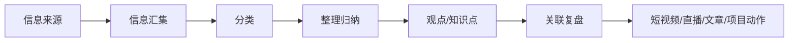

---
title: "知识库首页"
type: "home"
status: "使用中"
created: "2026-07-30"
updated: "2026-07-31"
tags:
  - 首页
  - 简化知识库
  - 知识库减肥
---

# 知识库首页

> 这个知识库现在只保留一个简单目标：把资料变成观点，把观点变成输出。

## 每天只看这里

1. 先打开 [[20-每日产出/今日升级]]。
2. 今天只推进 1 件小事。
3. 有新资料：处理 1 条资料。
4. 没有新资料：从旧资料里提炼 1 个观点。
5. 最后留下：1 个总结 / 1 张卡片 / 1 个选题。

## 五个主入口

### 1. 今日行动

- [[20-每日产出/今日升级]]：每天从这里开始。

### 2. 三个主题

- [[10-主题/沉香]]：沉香、线香、原材料、香文化、市场、内容选题。
- [[10-主题/修行]]：内观、觉察、经典、身心成长、生活秩序。
- [[10-主题/自媒体]]：选题、表达、平台、AI 工具、商业变现。

### 3. 项目区

- [[项目管理/项目管理总览]]：创业项目、账号数据、直播、短视频、复盘。

## 后台入口

这些不是每天必看，只在需要找资料时打开：

- [[30-资料池/资料池总览]]：原始资料、外部资料、临时收集。
- [[40-作品/作品总览]]：已经成形的作品、白板、输出。
- [[90-旧系统索引/旧系统索引]]：旧目录、旧 MOC、旧模板统一从这里找。
- [[99-系统/知识库减肥/知识库减肥对话审查总表]]：知识库减肥过程。

## 信息处理流程

## 现在的减肥规则

- 主入口只保留 5 个。
- 旧系统不删除，先降级为后台。
- 三大信息库保留资料，但不作为日常入口。
- 项目管理区独立，不和普通资料混在一起。
- 删除前必须先审查，不直接删资料。

## 最重要的一句话

> 不追求整理完，只追求每天能看懂、能使用、能输出。
