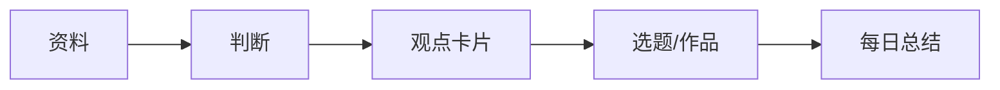

---
title: "知识库首页"
type: "home"
status: "使用中"
created: "2026-07-30"
updated: "2026-07-30"
tags:
  - 首页
  - 简化知识库
---

# 知识库首页

> 这个知识库只做一件事：每天把资料变成观点，把观点变成输出。

## 你每天只看这里

1. 打开 [[20-每日产出/今日升级]]
2. 不管有没有新资料，都写出 1 个新观点
3. 有资料就处理 1 条；没资料就从旧资料里衍生 1 条
4. 最后留下 1 个总结、1 张卡片、1 个可输出选题

## 三个大主题

- [[10-主题/沉香]]：沉香知识、产区、文化、市场、鉴别、内容选题
- [[10-主题/修行]]：内观、觉察、经典、身心成长、修行方法
- [[10-主题/自媒体]]：选题、表达、平台、AI 工具、商业变现

## 四个简单动作

## 分类怎么用

- 找方向：去 [[10-主题/沉香]] / [[10-主题/修行]] / [[10-主题/自媒体]]
- 找原始资料：去 [[30-资料池/资料池总览]]
- 找每天产出：去 [[20-每日产出/今日升级]]
- 找已成形作品：去 [[40-作品/作品总览]]

## 简化规则\n\n- [[00-开始这里/简化分类规则]]\n- [[90-旧系统索引/旧系统索引]]\n\n## 最重要的规则

- 不追求整理完，只追求每天推进一点点。
- 不迷信分类，分类只为帮助输出。
- 每天必须有新观点：可以来自新资料，也可以来自旧资料重组、反问、对比、衍生。
- 资料不要轻易删除；低价值资料可以归入资料池，成熟观点才进入主题页。

## 独立项目

- [[项目管理/项目管理总览]]：创业项目、账号数据、复盘、执行动作单独放这里，不和知识库资料混在一起。

