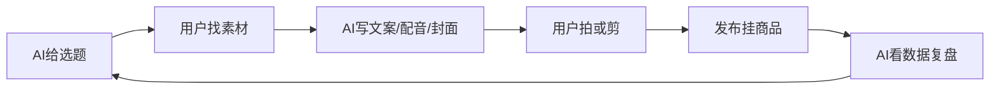

---
title: "AI短视频生产闭环"
type: "operation-flow"
status: "使用中"
created: "2026-07-30"
updated: "2026-07-30"
up: "[[项目管理/沉香抖音卖货/项目总览]]"
tags:
  - AI生产
  - 短视频
  - 线香
  - 闭环
---

# AI短视频生产闭环

> 先跑通闭环，再优化质量。不要卡在完美拍摄、完美文案、完美剪辑。

## 分工原则

### AI 负责

- 选题
- 标题
- 封面文案
- 短视频文案
- 配音稿
- 发布文案
- 评论引导
- 数据复盘
- 下一条优化建议

### 用户负责

- 判断方向对不对
- 找素材 / 拍简单素材
- 确认产品真实信息
- 确认能不能发布
- 根据数据决定继续 / 调整 / 停止

## 最小闭环

## 每条视频最低交付包

AI 每次至少输出：

1. 选题
2. 封面 3 个版本
3. 15 秒文案
4. 30 秒文案
5. 配音稿
6. 拍摄素材清单
7. 商品挂载建议
8. 评论引导话术
9. 发布后看什么数据

## 简单素材优先

当前阶段不追求复杂拍摄，只用：

- 线香燃烧
- 点香动作
- 香灰变化
- 香插 / 香炉
- 茶桌 / 书桌 / 床头
- 野生沉香原料特写
- 包装 / 商品细节
- 手部动作
- 光影 / 安静场景

## 简单文案方式

先用三段式：

1. 一句话钩子
2. 一个生活场景
3. 一个行动建议

示例：

> 你不是睡不着，
> 你是一天都没有真正慢下来。
> 睡前十分钟，点一支干净的沉香线香，让房间先安静下来。

## 发布前检查

- [ ] 是否体现主调性：发现美好，记录美好，分享美好
- [ ] 是否围绕线香打标签
- [ ] 是否有人群和场景
- [ ] 是否有商品链接
- [ ] 是否有评论引导
- [ ] 是否没有夸大功效

## 先跑起来的标准

一条视频只要满足：

- 画面清楚
- 文案人话
- 主题垂直
- 有线香
- 有美好感
- 能挂商品

就可以先发。
