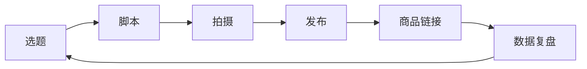

---
title: "短视频最小循环流程"
type: "operation-flow"
status: "使用中"
created: "2026-07-30"
updated: "2026-07-30"
up: "[[项目管理/沉香抖音卖货/项目总览]]"
tags:
  - 短视频
  - 线香
  - 最小循环
---

# 短视频最小循环流程

> 当前短视频目的：用线香打账号标签，为抖店商品点击和后续直播做铺垫。

## 最小循环

## 每条短视频必须回答

1. 这条是给谁看的？
2. 他现在有什么不舒服/不满足？
3. 线香如何成为一个具体动作？
4. 野生沉香原料如何提供信任？
5. 结尾让用户做什么？评论、私信、点商品、进直播？

## 固定输入

每次生成短视频前，至少要有：

- 主题：睡前 / 修行 / 成长 / 空间 / 原料 / 避坑
- 观众：新手 / 睡前焦虑 / 修行人 / 茶室用户 / 送礼用户
- 时长：15 秒 / 30 秒 / 60 秒
- 产品：线香 / 原料展示 / 试香装
- 目标动作：评论 / 点商品 / 关注 / 进直播

缺任何一项，先补齐再写脚本。

## 标准结构

### 15 秒版

1. 0–3 秒：反常识钩子
2. 3–10 秒：讲一个人话观点
3. 10–15 秒：线香动作 + 互动口令

### 30 秒版

1. 0–3 秒：钩子
2. 3–12 秒：问题场景
3. 12–22 秒：线香/原料解释
4. 22–30 秒：评论或商品引导

### 60 秒版

1. 0–5 秒：强钩子
2. 5–20 秒：故事/场景
3. 20–40 秒：产品逻辑
4. 40–55 秒：信任背书
5. 55–60 秒：行动指令

## 发布检查

- [ ] 前 3 秒是不是人话？
- [ ] 有没有明确人群？
- [ ] 有没有线香场景？
- [ ] 有没有商品链接？
- [ ] 有没有评论关键词？
- [ ] 是否垂直于“高品质沉香线香 + 静心成长”？

## 复盘规则

### 播放低

看：前 3 秒、封面、账号标签。

### 完播低

看：中间废话、节奏、画面变化。

### 互动低

看：有没有争议/提问/关键词引导。

### 点商品低

看：产品出现是否太晚、需求是否不明确。

## 每日输出

每天最少形成：

- 1 条短视频脚本
- 1 个标题钩子
- 1 条数据复盘
- 1 个明日改进点
